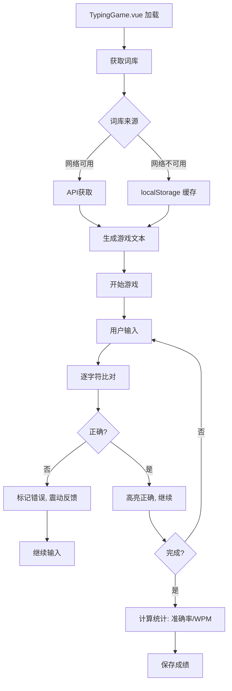

# 词库与打字游戏模块设计文档

## 📚 词库模块设计

### 模块文件结构
```
lingo_cube_web/src/
├── api/word.ts          # API客户端
├── views/wordBank.ts    # 词库数据模型
└── views/TypingGame.vue # 词库使用场景
```

### 数据结构定义

#### 词库项接口 (`views/wordBank.ts`)
```typescript
interface WordItem {
  english: string        // 英文单词
  chinese: string        // 中文释义
  phonetic: string       // 音标 (自动生成)
  examples?: WordExample[]  // 例句 (可选)
}

interface WordExample {
  text: string          // 例句文本
  weight: number        // 权重/难度系数
}
```

### 音标生成逻辑 (`genPhonetic()`)
**算法规则**:
1. **基础处理**: 转小写，逐字符处理
2. **辅音组合**:
   - `sh` → `ʃ`, `th` → `θ`, `ch` → `tʃ`, `ph` → `f`
   - `ck` → `k`, `ng` → `ŋ`
3. **元音规则**:
   - 元音字母发音映射 (a→/æ/, e→/e/, i→/aɪ/, o→/ɒ/, u→/ʌ/)
   - 静音e规则: 结尾不发音
4. **特殊模式**:
   - `-tion/-sion` → `ʃən/ʒən`
   - `-cial/-tial` → `ʃəl`
   - `y`开头 → `/j/`, 在元音后 → `/i/`

**示例**:
- "example" → `/ɪɡˈzæmpəl/`
- "psychology" → `/saɪˈkɒlədʒi/`

### API客户端设计 (`api/word.ts`)

#### 请求策略
| 场景 | 行为 | 超时 |
|------|------|------|
| API成功 | 返回远程词库 | 5s |
| API失败 | Fallback本地词库 | 无 |
| 网络错误 | 使用缓存 (localStorage) | 3s |

#### 接口定义
```typescript
interface WordAPI {
  getAllWords(): Promise<WordItem[]>
  getRandomWords(count: number): Promise<WordItem[]>
  getWordDetail(english: string): Promise<WordItem>
}
```

#### 缓存机制
- 本地存储: `localStorage['lingo_words']`
- 缓存失效: 页面刷新时更新
- 大小限制: ≤500KB

## 🎮 打字游戏模块设计

### 模块文件结构
```
src/
├── views/TypingGame.vue      # 核心组件
├── stores/useGameStore.ts    # 游戏状态管理
├── utils/typingLogic.ts      # 打字判断逻辑
└── styles/theme-[dark|ins|cute].css  # 主题样式
```

### 游戏状态设计 (`useGameStore.ts`)

```typescript
interface GameState {
  // 当前文本
  currentText: string        // 待打内容
  userInput: string         // 用户输入
  correctChars: number      // 正确字符数
  totalChars: number        // 总字符数
  
  // 计时
  startTime: number         // 开始时间戳
  elapsed: number           // 已用时间(秒)
  isActive: boolean         // 游戏进行中
  
  // 主题
  theme: 'dark' | 'ins' | 'cute'
  
  // 模式
  mode: 'practice' | 'test'  // 练习模式 vs 测试模式
}
```

### 核心逻辑 (`typingLogic.ts`)

#### 字符比对算法
```typescript
function compareInput(user: string, target: string): {
  correct: boolean[],
  accuracy: number,
  wpm: number
} {
  const correct = user.split('').map((c, i) => c === target[i])
  const accuracy = correct.filter(Boolean).length / target.length * 100
  const wpm = Math.round((target.length / 5) / (elapsed / 60))
  return { correct, accuracy, wpm }
}
```

#### 难度分级
| 等级 | 单词长度 | 特殊字符 | 速度要求 |
|------|----------|----------|----------|
| 简单 | ≤5 | 无 | ≥30 WPM |
| 中等 | 6-10 | 连字符 | ≥40 WPM |
| 困难 | >10 | 撇号 | ≥50 WPM |

### 主题系统设计

#### 主题切换机制
```typescript
// composables/useTheme.ts
const theme = ref<'dark' | 'ins' | 'cute'>('dark')

const themeClasses = computed(() => ({
  'theme-dark': theme.value === 'dark',
  'theme-ins': theme.value === 'ins',
  'theme-cute': theme.value === 'cute'
}))

// 动态加载CSS
const loadThemeCSS = () => {
  import(`./styles/theme-${theme.value}.css`)
}
```

#### 主题配色方案
| 主题 | 背景色 | 文字色 | 强调色 | 字体 |
|------|--------|--------|--------|------|
| dark | #1a1a2e | #e0e0e0 | #00d4ff | Consolas |
| ins | #f5f5f5 | #333333 | #ff6b6b | 'Segoe UI' |
| cute | #fff5f5 | #e91e63 | #ff8fab | 'Comic Sans MS' |

### 3. 模块交互流程



## 🔧 维护与扩展指南

### 常见问题处理
| 问题 | 解决方案 |
|------|----------|
| 词库加载慢 | 启用Service Worker预缓存 |
| 音标不准 | 维护例外词白名单 |
| 主题切换闪烁 | CSS变量预加载 |
| 输入延迟 | 防抖处理 (200ms) |

### 扩展建议

#### 词库扩展
1. **新增语言**: 添加 `lang` 字段支持多语言
2. **难度标签**: 为词条添加 `level: 'A2'|'B1'|'C1'`
3. **发音音频**: 增加 `audioUrl` 字段

#### 游戏功能增强
- 语音识别输入 (`Web Speech API`)
- 自定义词库导入
- 多人对战模式
- 成就系统

#### 性能优化
- 虚拟滚动 (1000+词条时)
- Web Worker处理字符比对
- 渐进式加载 (先显示前20词)

## 📊 数据统计接口

```typescript
interface StatsAPI {
  saveScore(userId: string, score: GameStats): Promise<void>
  getLeaderboard(): Promise<Ranking[]>
  getUserHistory(userId: string): Promise<GameStats[]>
}

interface GameStats {
  date: string
  score: number
  wpm: number
  accuracy: number
  theme: string
  mode: string
}
```

---

**维护提示**: 所有模块变更需在 `AGENTS.md` 中记录版本更新，保持文档与代码同步。